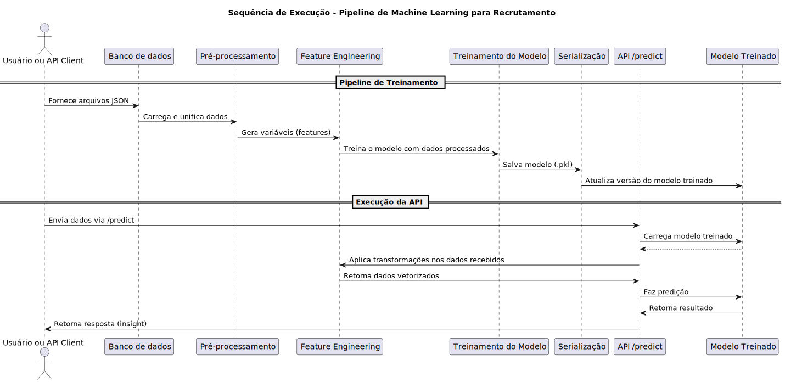

### 1. **Resumo do Projeto**

Este projeto visa a construção e disponibilização de uma solução baseada em Inteligência Artificial para apoiar os processos de recrutamento e seleção, utilizando dados reais da empresa Decision.

**Objetivos principais:**
- Aumentar a eficiência no "match" entre candidatos e vagas;
- Otimizar o tempo e a qualidade nas entrevistas;
- Aprender com dados históricos para apoiar novos processos seletivos;
- Identificar perfis ideais de candidatos(as).

---

### 2. **Critérios de Entrega Atendidos**

- [x] **Treinamento do modelo preditivo**
- [x] **Crie uma API para deployment do modelo**
- [x] **Realize o empacotamento do modelo com Docker**
- [x] **Deploy do modelo**
- [x] **Teste da API**
- [x] **Testes unitários**
- [ ] **Monitoramento Contínuo**

---

### 3. Pré-requisitos para Execução do Projeto

- Docker
- Docker-compose
- Python 3.12+
- `curl` (para testes manuais da API)

---

### 4. Setup do Projeto
#### 4.1 Verificação da Instalação do Docker
Execute os comandos abaixo para verificar se o Docker e o Docker Compose estão corretamente instalados:
```bash
docker --version
docker-compose --version
```
Se os comandos retornarem as versões instaladas, a instalação está correta.

#### 4.2 Build da Imagem Docker
Navegue até a raiz do projeto onde se encontram os arquivos `docker-compose.yml` e `Dockerfile`:
```
cd caminho/para/projecto
```
Para construir a imagem do projeto pela primeira vez:
```
docker-compose up --build
```
Este comando irá:
- Construir a imagem da aplicação com base no `Dockerfile`
- Instanciar e iniciar os serviços definidos no `docker-compose.yml`

#### 4.3 Rebuild da Imagem (forçar nova build)
Caso tenha feito alterações no código e deseje reconstruir:
```bash
docker-compose up --build --force-recreate
```

#### 4.4 Verificar se os Containers estão em Execução
Execute:
```bash
docker ps
```
Você deverá ver os containers ativos listados, com seus nomes, status e portas mapeadas (ex: `0.0.0.0:80->80/tcp`).
Para logs em tempo real da aplicação:

```bash
docker-compose logs -f
```


---

### 5. Testes

Em um novo terminal (diferente do terminal de intancia do Docker), execute os testes a seguir.

#### 5.1 Teste da API
```bash
curl -X POST http://localhost:80/predict/ ^
  -H "Content-Type: application/json" ^
  -d "{\"jsonrpc\": \"2.0\", \"method\": \"candidate_match\", \"params\": {\"vaga_data\": {\"titulo_vaga\": \"Desenvolvedor\"}, \"curriculo_text\": \"Experiência com Django\"}, \"id\": 0}"
```

**Resposta esperada:**

```json
{
  "result": {
    "probabilidade de match": 86.33
  },
  "id": 0,
  "jsonrpc": "2.0"
}
```

#### 5.2 Lint

```bash
docker-compose exec app flake8 --count --max-line-length=119 --show-source --statistics --doctests src/ tests/
```

#### 5.3 Testes Unitários

```bash
docker-compose exec app coverage run
```

---

### 6. Arquitetura do Projeto

-  **Pipeline de Machine Learning**
	1. **Leitura dos dados**
	2. **Limpeza e pré-processamento**
	3. **Feature Engineering**
	4. **Divisão de treino/teste**
	5. **Treinamento do modelo preditivo**
	6. **Validação com métricas**
	7. **Serialização do modelo com Pickle ou Joblib**

- **API de Predição**
	- Construída com **Flask**;
	- Endpoint `/predict` para receber dados e responder previsões;
	- Testes com `cURL`.

- **Docker**
	- `Dockerfile` com todas as dependências;
	- Garantir execução em qualquer ambiente.

- **Deploy Local**

- **Testes**
	- **Testes unitários** para pipeline e componentes;
	- **Logs de monitoramento**;
	- Painel para **monitoramento de drift** no modelo.

---
### 7. Diagrama de Sequência



---

### 8. Estrutura do Projeto

```plaintext
tech_chellange_5/
├── notebooks/                       # <Prototipagem e treinamento do modelo (EDA, engineering feature, train model)>
│   ├── dados/
│   │   ├── applicants.json
│   │   ├── prospects.json
│   │   ├── vagas.json
│   │   └── [...]
│   ├── model_path/ [...]            # <Artifacts dos modelo treinado>
│   ├── 00_eda.ipynb
│   ├── 01_feature_engineering.ipynb
│   └── 02_train_model.ipynb
├── src/
│   ├── application/ [...]           # <Camada para Interação com a API. Recebe os dados externos, aciona o domain e retorna para API>
│   ├── domain/ [...]                # <Camada de processamento dos dos dados recebido (Regras de negócio, features engineering)
│   ├── infra/ [...]                 # <Camada onde ficam elementos infraestrutura que ajudam o serviço a funcionar
│   ├── main.py                      # <Orquestrador do aplicativo (API)>
│   └── routes.py
├── tests/ [...]                     # <Testes Unitários
├── var/ [...]
├── .coveragerc
├── .dockerignore
├── .gitignore
├── docker-compose.yml
├── Dockerfile
├── README.md
└── requirements.txt
```

---

### 9. Base de Dados

Os dados utilizados estão localizados em `notebooks/dados/`:

- `applicants.json`
- `prospects.json`
- `vagas.json`

Origem: [https://drive.google.com/drive/folders/1f3jtTRyOK-PBvND3JTPTAxHpnSrH7rFR?usp=sharing](https://drive.google.com/drive/folders/1f3jtTRyOK-PBvND3JTPTAxHpnSrH7rFR?usp=sharing)

---

### 10. Modelo de Predição

- Algoritmo: `RandomForestClassifier`
- Frameworks: `scikit-learn`, `nltk`
- Saída: Probabilidade de compatibilidade (0 a 100%)
#### Pré-processamento
- Conversão para minúsculas
- Remoção de pontuação
- Tokenização com nltk
- Remoção de stopwords
- Combinação do texto da vaga e do currículo
#### Vetorização
- Método: `TF-IDF` com `TfidfVectorizer`
- Parâmetros: `max_features = 5000`

#### Métricas
- Acurácia: 0.72
- F1-Score: 0.83
- Tempo de Treinamento: ~111 segundos

#### Colunas Utilizadas

- Vaga: `titulo_vaga`, `principais_atividades`, `competencia_tecnicas_e_comportamentais`, `tipo_contratacao`, `vaga_especifica_para_pcd`, `nivel_profissional`, `nivel_academico`, `nivel_ingles`
- Currículo: `cv_pt`
- Rótulo: `perfil_compativel` → "sim" = 1, "não" = 0
